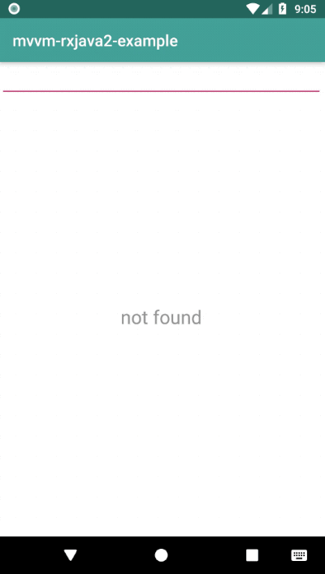

# Simple RxJava2+MVVM

A simple android application for retrieving repository lists by github username with Retrofit+RxJava. This app is based on the MVVM+Databinding structure.

## Getting Started
This sample uses the Gradle build system. To build this project, use the "gradlew build" command or use "Import Project" in Android Studio.

## Demo

## License
This project is licensed under the Apache License - see the [LICENSE](LICENSE) file for details
